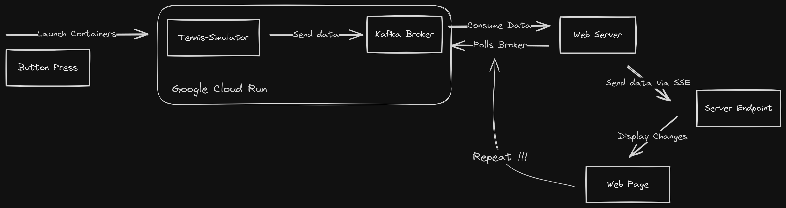

# Kafka Tennis Streaming
The Tennis Match Simulator is a real-time application that generates synthetic tennis scores, publishes them to a Kafka topic hosted on Google Cloud Run, and displays the scores on a webpage using Server-Sent Events (SSE). This README provides a detailed guide on setting up and running the project.

## :ledger: Index

- [About](#beginner-about)
- [Tools](#tools)
- [How?](#zap-how)
- [File Structure](#file_folder-file-structure)
- [Resources](#page_facing_up-resources)

##  :beginner: About
This project began as a way to integrate the power of Kafka's real-time messaging with a web server. The end decision to use Server-Side Events (SSE) instead of Websockets only stem from the fact that user interaction wasn't required. I decided to create a my own synthetic tennis match simulator instead of using an api since the frequency of high-level tennis events was too low and that it is a simple game to program. After each point, the tennis simulator would publish the match's stats to a Kafka topic. The data would then get consumed by the web server with asynchronous polling and sent via SSE to the project's endpoint. A simple JavaScript script updates the tables HTML contents to display the new data in real-time.

##  :toolbox: Tools
- Python 3.8+
- Kafka
- Docker
- Google Cloud SDK (for deploying to Google Cloud Run)

## :zap: How
Here's a summary explaining how the project works.
The following workflow is performed:

1. **Initialize Cloud Containers:** On user button press, send a request via the Google Cloud Run API to start containers. The container images are stored in the Google Artifact Registry.
2. **Run Tennis Simulation:** The Tennis-Simulator container only starts after Kafka Broker health check is healthy. It automatically runs the tennis match script and publishes the data to the Kafka topic.
3. **Create SSE:** On user button press, the SSE connection between the web server consuming from the topic and the project endpoint responsible for displaying the data in real-time.
4. **Poll Broker:** The Kafka consumer polls the topic for new messages.
5. **Display message data:** The consumer sends the message data via SSE to the endpoint where a JavaScript script updates the HTML to display the new match scores.
6. **Repeat !:** Repeat steps 4 and 5 until the match is over. The SSE connection and polling is then stopped.



This workflow automates the entire process of creating the synthetic match data, initializing cloud resources, all the way to displaying the data on the web page in real-time.


##  :file_folder: File Structure

```
.
├── docker/
├── requirements/
├── scripts/
│   ├── fastapi-app.py (consumer)
│   └── tennis-simulator.py (producer)
│
├── docker-compose.kafka.yml
└── docker-compose.yml
```

##  :page_facing_up: Resources
Link to the final project.\
https://shaynelusser.com/projects/tennis-streaming

Links to resources used during this project.
https://cloud.google.com/run/docs (Google Cloud)\
https://www.confluent.io/events/kafka-summit-europe-2021/server-sent-events-using-reactive-kafka-and-spring-web-flux/ (Kafka SSE)\
https://shorturl.at/23tOu (Kafka)
